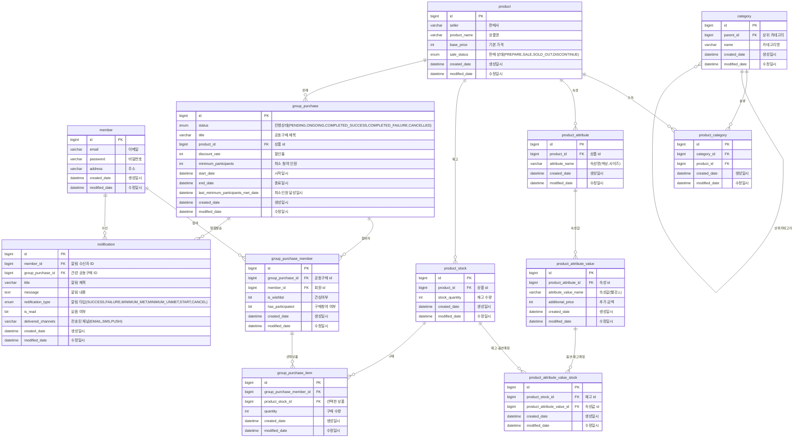
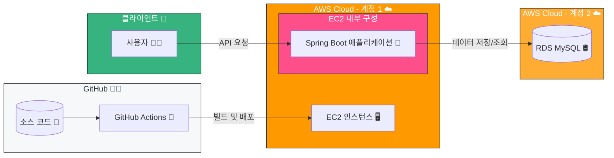

# 🧺 Group-wise 공동구매 서비스
공동구매 서비스 api 서버 토이 프로젝트입니다.

## ⚙️ 사용 기술
- 백엔드: Spring Boot, Spring Security, JPA/Hibernate, QueryDSL
- 데이터베이스: MySQL, Flyway(마이그레이션)
- 인프라/배포: AWS, GitHub Actions
- 테스트: JUnit

## 📖 프로젝트 목표
### 기술적 목표

1. **Spring 기반 백엔드 애플리케이션 구현**
    - Spring Data JPA와 QueryDSL을 활용한 타입 안전 쿼리 구현
    - 복잡한 도메인 관계 매핑 및 효율적인 데이터 접근 패턴 적용
    - Flyway를 활용한 데이터베이스 마이그레이션 관리
    - AWS 환경 배포 및 GitHub Actions를 활용한 CI/CD 파이프라인 구축
2. **도메인 주도 설계(DDD) 접근 방식 적용**
    - 비즈니스 도메인 개념을 중심으로 엔티티 모델링
    - 애그리게이트 경계 설정을 통한 일관성 있는 도메인 설계
    - 도메인 이벤트를 활용한 시스템 간 느슨한 결합 구현
    - 풍부한 도메인 모델을 통한 비즈니스 규칙 캡슐화
3. **보안 및 인증 체계 구현**
    - JWT 기반 사용자 인증 메커니즘 구축
    - Spring Security와 연계한 인증 필터 및 토큰 검증 구현
    - 권한 기반 API 접근 제어
4. **성능 및 품질 관리** *(향후 개선 예정)*
    - N+1 문제 해결 및 성능 최적화 전략 적용
    - 인프라스트럭처 관심사의 명확한 분리
    - 체계적인 예외 처리 및 오류 관리 전략

## 📋 주요 기능 소개

1. **상품 및 재고 관리**
    - 다양한 상품 속성 및 옵션 구성 관리
    - 상품 재고 관리 및 구매 시 수량 조정
    - 상품 정보 CRUD 및 상태 관리
2. **공동구매 프로세스**
    - 공동구매 생성, 참여, 취소, 완료 등 핵심 비즈니스 흐름 구현
    - 최소 참여 인원 기반 공동구매 성공/실패 자동 처리
    - 할인율 기반 가격 정책 적용
    - 공동구매 상태에 따른 제약 조건 및 비즈니스 규칙 적용
3. **이벤트 기반 알림 시스템**
    - 공동구매 상태 변경 시 이벤트 발행 및 구독
    - 알림 메시지 생성 및 저장
    - 다양한 알림 채널 지원을 위한 확장 구조 설계
4. **사용자 인증 및 기본 관리**
    - JWT 기반 사용자 인증
    - 회원 가입 및 기본 정보 관리
    - 공동구매 참여 및 관심 표시 기능

## 🏃‍♀️‍➡️ 중점적으로 고민했던 기술 요소

### 도메인 모델 캡슐화와 경계 설정
애그리게이트 간 경계를 명확히 하고 내부 구현을 은닉하는 과정에서, 코드의 복잡성과 유지보수성 사이의 균형을 고민했습니다. Product와 GroupPurchase 도메인에서 외부에서 직접 접근을 제한하면서도 필요한 기능은 제공할 수 있도록 Protected 접근 제어자와 메서드 설계에 신경썼습니다.

### QueryDSL과 Java Stream API의 적절한 활용 지점 결정
복잡한 검색 조건과 정렬을 구현하는 과정에서, 모든 로직을 QueryDSL에 집중시키는 것과 일부 처리를 서비스 레이어의 Java 코드로 분산시키는 것 사이의 균형점을 고민했습니다. 특히 `GroupPurchaseRepositoryImpl`에서는 기본적인 필터링은 QueryDSL로 처리하되, 복잡한 계산이 필요한 정렬 조건(남은 시간, 참여율 등)은 서비스 레이어에서 Java Stream API로 처리하는 방식을 채택했습니다. 이 접근 방식은 코드 가독성과 유지보수성을 높이는 효과가 있었습니다.

```java
// Repository에서 기본 필터링
@Override
public List<GroupPurchase> searchGroupPurchases(GroupPurchaseSearchRequest searchRequest) {
   JPAQuery<GroupPurchase> contentQuery = queryFactory
           .selectFrom(groupPurchase)
           .where(createWhereCondition(searchRequest));
   // 단순 정렬만 적용
   return contentQuery.fetch();
}

// Service에서 복잡한 정렬 로직 처리
private void sortByRemainingTime(List<GroupPurchase> results, SortDirection direction) {
   LocalDateTime now = LocalDateTime.now();
   Comparator<GroupPurchase> comparator = Comparator.comparing(
           gp -> Duration.between(now, gp.getEndDate()).getSeconds()
   );
   if (direction == SortDirection.DESC) {
      comparator = comparator.reversed();
   }
   results.sort(comparator);
}
```

### 이벤트 기반 시스템 설계
공동구매 상태 변경 시 알림 발송, 주문 생성 등 여러 후속 처리가 필요한 상황에서, 각 서비스 간 직접적인 의존성을 줄이기 위해 이벤트 기반 아키텍처를 적용했습니다. GroupPurchaseService는 상태 변경 시 해당 이벤트만 발행하고, 실제 처리는 각 이벤트 리스너가 담당하는 구조입니다. 이를 통해 서비스 간 결합도를 낮추고, 새로운 기능 추가 시 기존 코드 수정 없이 새 리스너만 추가하는 확장성을 확보했습니다. 또한 각 서비스가 자신의 핵심 책임에만 집중할 수 있어 코드의 응집도도 향상되었습니다.
```java
// 이벤트 발행 (GroupPurchaseSchedulerService)
if (newStatus == Status.COMPLETED_SUCCESS) {
        eventPublisher.publishSuccessEvent(new GroupPurchaseSuccessEvent(this, groupPurchase));
}

// 이벤트 구독 (GroupPurchaseEventListener)
@EventListener
public void handleGroupPurchaseSuccessEvent(GroupPurchaseSuccessEvent event) {
   GroupPurchase groupPurchase = event.getGroupPurchase();
   // 알림 발송 로직
}
```

### 제네릭 프로그래밍을 통한 유연한 유틸리티 개발
상품의 다양한 옵션 조합을 생성하는 과정에서, 타입 안전성과 재사용성을 모두 확보하기 위해 제네릭 프로그래밍 기법을 적용했습니다. ListUtils 클래스의 데카르트 곱 계산 알고리즘은 다양한 타입에 적용 가능하도록 설계했습니다.
```java
public static <V> List<List<V>> cartesianProduct(List<? extends ContainerOfValues<V>> listOfContainer) {
// 데카르트 곱 알고리즘 구현
}
```

### 현대적 Java 기능 활용
Java 14+ 레코드 기능을 활용하여 DTO를 간결하고 명확하게 설계했습니다. 이를 통해 데이터 전송 객체의 불변성을 보장하고 보일러플레이트 코드를 최소화했습니다.
```java
public record GroupPurchaseDetailResponse(
    long id,
    String title,
    // ... 필드들
) {
    // 필요한 메서드만 추가
}
```

### Spring Security 통합 및 JWT 인증
토큰 기반 인증 메커니즘을 Spring Security와 통합하는 과정에서, 코드 중복을 최소화하고 보안 정책을 중앙화하기 위해 JwtTokenProvider 클래스를 설계했습니다. 이를 통해 인증 로직의 응집도를 높이고 유지보수성을 개선했습니다.

### 데이터 컨버터를 활용한 다중 값 처리 최적화
Notification 엔티티의 deliveredChannels 필드 설계에서, 알림 채널(EMAIL, SMS, PUSH 등)을 저장하기 위해 별도의 테이블을 사용하는 대신 JPA 컨버터를 활용하는 접근 방식을 선택했습니다. 이를 통해 엔티티 모델에서는 Set<DeliveryChannel> 형태로 사용하면서도, 데이터베이스에는 단일 컬럼에 쉼표로 구분된 문자열로 저장하여 스키마 단순화와 조회 성능을 모두 확보했습니다.

## 📊 ERD 다이어그램



## 🚀 배포 구성도

